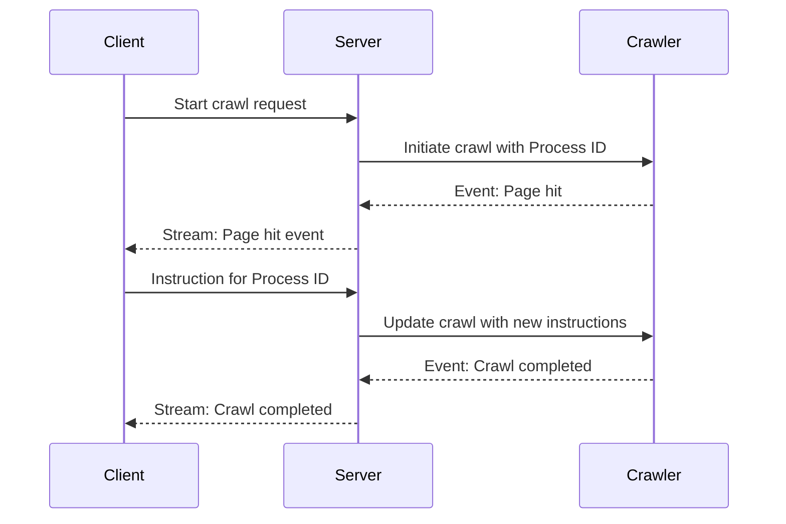

## 在 Crawl4AI 中引入事件流和交互式钩子

在不久的将来，我计划通过引入事件流机制来增强 Crawl4AI 的能力，该机制将为客户端提供更深层次、实时的爬取过程洞察。目前，钩子（hooks）是代码层面的一个强大功能——它们让开发者可以在爬取的关键节点定义自定义逻辑。然而，当将 Crawl4AI 作为服务（例如，通过 Docker 化的 API）使用时，在运行时与这些钩子进行交互并不容易。

**有什么变化？**

我正在开发一种解决方案，允许爬虫程序发射连续的事件流，向客户端更新当前的爬取阶段、遇到的页面以及任何决策点。这个事件流可以通过像服务器发送事件（SSE）或 WebSockets 这样的标准化协议暴露出来，使得客户端可以在爬虫工作时“订阅”并监听。

**通过进程 ID 实现交互性**

这个新设计的一个关键部分是为每个爬取会话分配一个唯一进程 ID（process ID）的概念。想象一下，您正在监听一个事件流，它通知您：
- 爬虫刚刚访问了某个页面
- 它触发了一个钩子，现在正暂停等待指令

有了事件流，您可以向服务器发送一个后续请求——引用唯一的进程 ID——以提供额外的数据、指令或参数。这可能包括选择接下来要跟踪的链接、调整提取策略或为受保护的 API 提供认证令牌。一旦爬虫接收到这些指令，它就会在更新后的上下文中恢复执行。

**为开发者和用户带来的好处**

1. **细粒度控制**：您无需预先定义所有逻辑，而是可以根据爬取过程中遇到的实际数据和条件动态地指导爬虫。
2. **实时洞察**：在进度、错误或网络瓶颈发生时实时监控，而无需等待整个爬取完成。
3. **增强的协作**：不同的团队成员或自动化系统可以监视相同的爬取事件并提供输入，使爬取过程更具适应性和智能性。

**下一步计划**

我目前正在探索最佳的 API、技术和模式，以使这一愿景成为现实。我的目标是提供一种无缝的开发者体验——既能与现有的 Crawl4AI 工作流集成，又能提供新的灵活性和强大功能。

请继续关注更多更新，因为我将继续构建此功能。同时，我很乐意听取您可能有的任何反馈或建议，以帮助塑造 Crawl4AI 这种交互式、事件驱动的网络爬取未来。